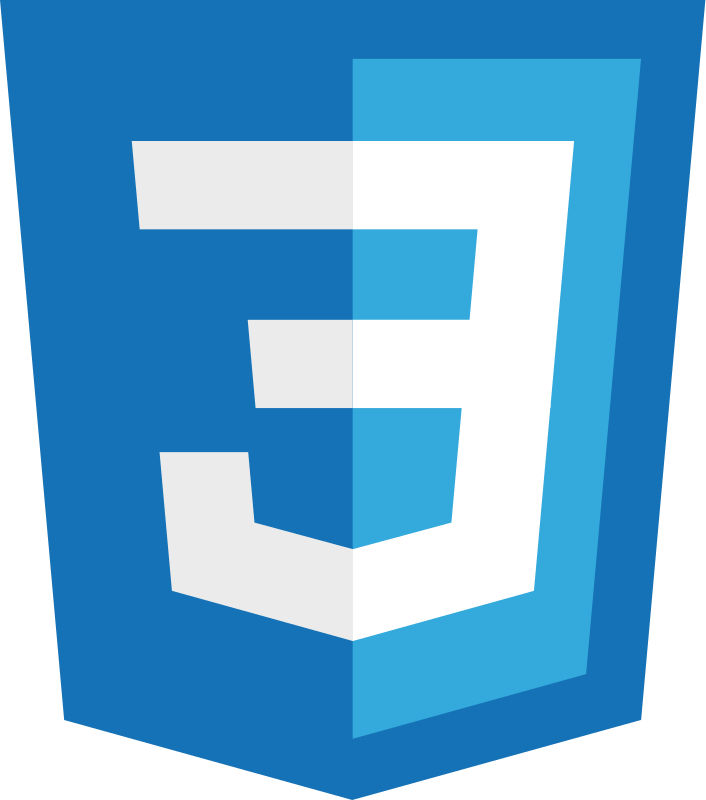
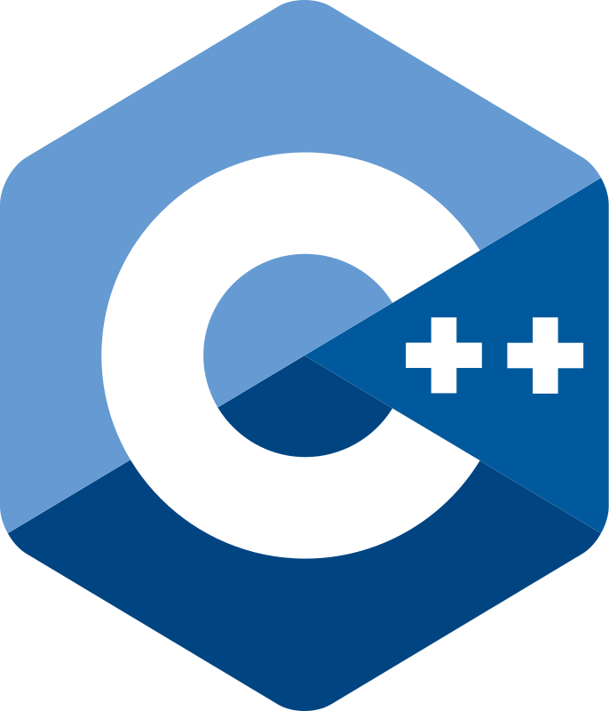
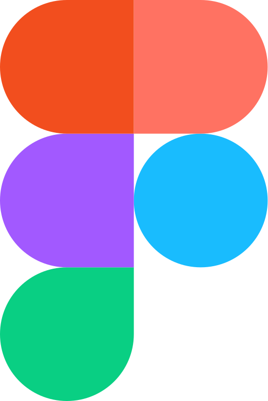
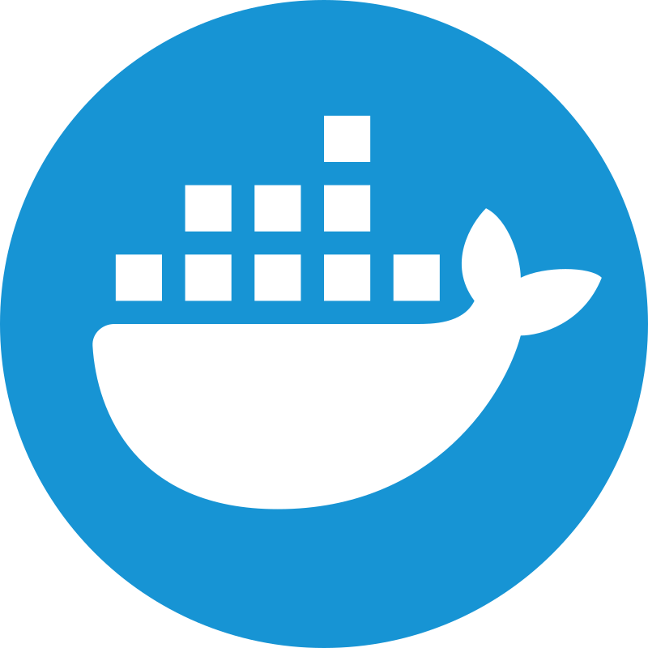
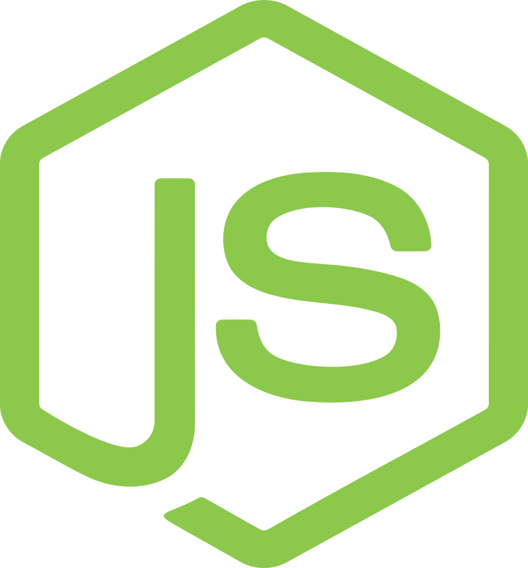
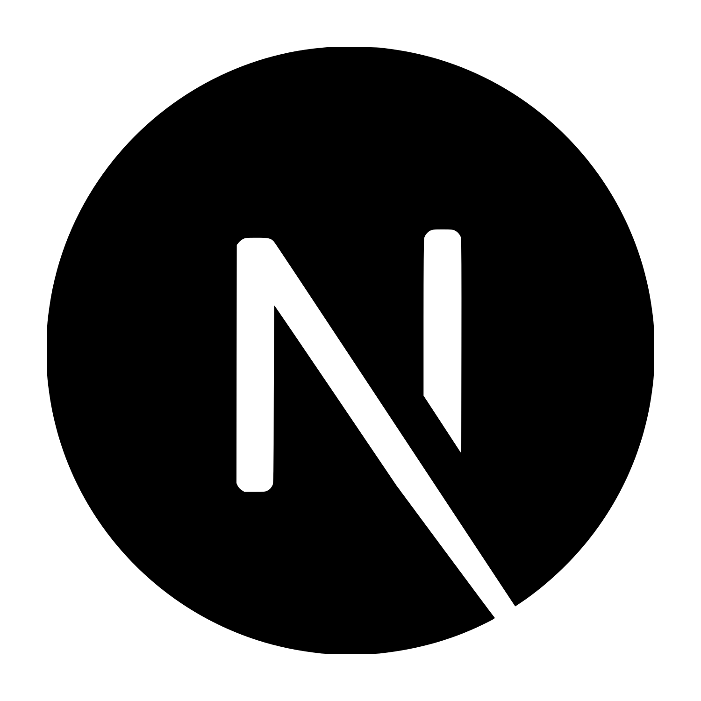

<header>
  

    
    <h1>iannsgirdye</h1>
    

      Студент <a href="https://mai.ru" target="_blank">Московского авиационного института</a> факультета компьютерных наук и прикладной математики 
      Развиваюсь во <b>frontend разработке</b>
    

  

</header>
 
<main>
  <section>
    <h2>Технологии</h2>
    

      
      &ensp;
      
      &ensp;
      
      &ensp;
      
      &ensp;
      
    

    <article>
      <h3>В планах</h3>
      

        
        &ensp;
        
        &ensp;
        
      

    </article>
  </section>
   
  <section>
    <h2>Инструменты</h2>
    

      
      &ensp;
      
      &ensp;
      
      &ensp;
      
      &ensp;
      
      &ensp;
      
      &ensp;
      
    

    <article>
      <h3>В планах</h3>
      

        
        &ensp;
        
        &ensp;
        
        &ensp;
        
        &ensp;
        
      

    </article>
  </section>
   
  <section>
    <h2>Репозитории</h2>
    <article>
      <h3>🧸 Собственные проекты</h3>
      <table>
        <thead>
          <tr>
            <th>Название</th>
            <th>Описание</th>
          </tr>  
        </thead>
        <tbody>
          <tr>
            <td><a href="https://github.com/iannsgirdye/mai_library">mai_library</a></td>
            <td>Сборник цифровых сервисов и информационных ресурсов организаций Московского авиационного института, материалов для самообразования и статей на различные темы.</td>
          </tr>
          <tr>
            <td><a href="https://github.com/the-tender-team/tender-parsing">Tender Parsing</a></td>
            <td>Веб-сервис для парсинга сайтов государственных закупок с целью отслеживания тендеров, в которых могут быть потенциальные проблемы.</td>
          </tr>
          <tr>
            <td><a href="https://github.com/iannsgirdye/resonator">Resonator</a></td>
            <td>(в процессе) Адаптивная вёрстка одностраничного сайта по макету</td>
          </tr>
          <tr>
            <td><a href="https://github.com/iannsgirdye/mai_booking-auditoriums">mai_booking-auditoriums</a></td>
            <td>Веб-сервис бронирования комнат на IT-этаже МАИ</td>
          </tr>
        </tbody>
      </table>
    </article>
    <article>
      <h3>🦐 Форки</h3>
      <table>
        <thead>
          <tr>
            <th>Название</th>
            <th>Описание</th>
          </tr>  
        </thead>
        <tbody>
          <tr>
            <td><a href="https://github.com/iannsgirdye/jstu4">jstu4</a></td>
            <td>Обновлённый интерактивный эмулятор Машины Тьюринга, реализованный на HTML и JS</td>
          </tr>
        </tbody>
      </table>
    </article>
    <article>
      <h3>🎓 Задания в университете</h3>
      <table>
        <thead>
          <tr>
            <th>Семестры</th>
            <th>Дисциплина</th>
          </tr>
        </thead>
        <tbody>
          <tr>
            <td>3 и 4</td>
            <td><a href="https://github.com/iannsgirdye/mai_fundamental-algorithms">Фундаментальные алгоритмы</a></td>
          </tr>
          <tr>
            <td>3</td>
            <td><a href="https://github.com/iannsgirdye/mai_object-oriented-programming">Объектно-ориентированное программирование</a></td>
          </tr>
        </tbody>
      </table>
    </article>
    <article>
      <h3>📖 Образовательные курсы</h3>
      <ul>
        <li><a href="https://github.com/iannsgirdye/yandex_python">Хендбук "Основы Python" от "Яндекс Образования"</a></li>
        <li><a href="https://github.com/iannsgirdye/yandex_algorithms">Хендбук "Основы алгоритмов" от "Яндекс Образования"</a></li>
        <li><a href="https://github.com/iannsgirdye/stepik_mfti-c">Курс "C для начинающих" от МФТИ на Stepik</a></li>
        <li><a href="https://github.com/iannsgirdye/yandex_cpp">Хендбук "Основы C++" от "Яндекс Образования"</a></li>
      </ul>
    </article>
    <article>
      <h3>🔥 Нарешивание заданий</h3>
      <ul>
        <li><a href="https://github.com/iannsgirdye/leetcode">LeetCode</a></li>
        <li><a href="https://github.com/iannsgirdye/yandex_coderun">Coderun</a></li>
      </ul>
    </article>
  </section>
   
  <section>
    <h2>Контакты</h2>
    

      
      &ensp;
      
    

  </section>
   
  <section>
    <h2>Статистика</h2>
    

      
      
      
      
    

  </section>
</main>

<!-- Sources
https://icons8.com/icon/40670/c-programming
-->
